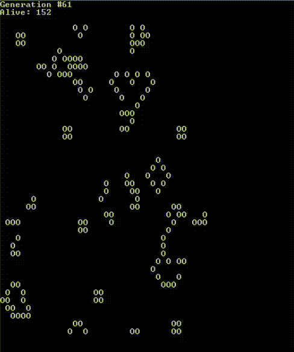

# "Game of Life" go project!

This project allows you to create a small inhabited universe and observe the many patterns in which "life" can evolve. 
Generation by generation, watch the cells come and go, reacting to their environment, perishing from loneliness or finding comfort in company.

The "Game of Life" is a classic toy for programmers to entertain and educate themselves. It's written in Go programming language.

## Getting Started

To run the project, you will need to have Go installed on your machine.

1. Clone the repository: `git clone https://github.com/rugpanov/go-game-of-life.git`
2. Navigate to the project directory: `cd go-game-of-life`
3. Run the project: `go run main.go`
4. Provide required parameters

## Usage

The project will start with an initial pattern of cells. You can then observe how the pattern changes generation by generation.

## Rules

1. A live cell survives if it has two or three live neighbors; otherwise, it dies of boredom (<2) or overpopulation (>3).
2. A dead cell is reborn if it has exactly three live neighbors.

## Hypnotizing Warning

Be careful, this project might be hypnotizing!

## Contributing

If you're interested in contributing to this project, please feel free to submit a pull request.

## Licensing

This project is licensed under the MIT License. See LICENSE for more details.